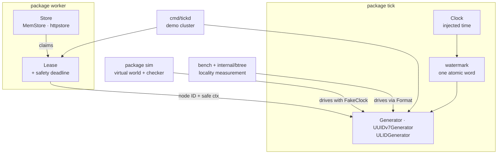
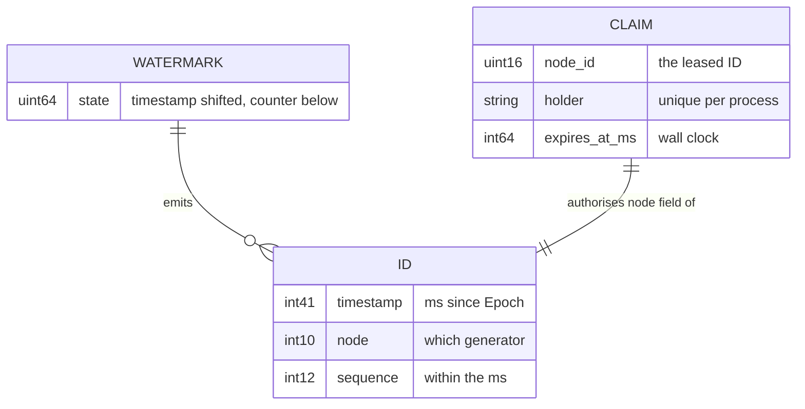
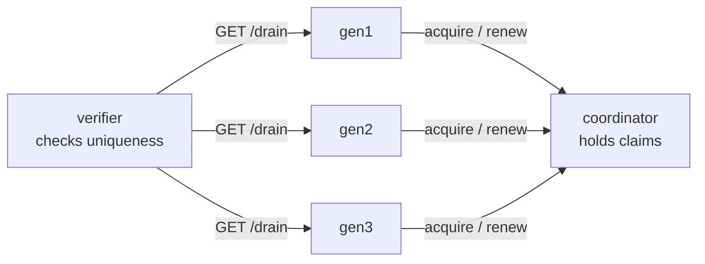

# Architecture

[← index](README.md) · next: [02-flow.md](02-flow.md)

## Components

Four units, each with one job. The dependency arrows all point inward to the
root package; nothing in the root package imports anything below it.

| Component | Implements | Owns |
|---|---|---|
| **Core library** (`package tick`) | [root of the repo](../../) | Time, the bit layouts, the CAS loop, the three formats |
| **Node-ID allocation** (`package worker`) | [worker/](../../worker/) | Claiming a node ID and giving it up safely |
| **Simulator** (`package sim`) | [sim/](../../sim/) | Running the real generators against adversarial clocks and checking invariants |
| **Measurement** (`internal/btree`, `bench`) | [internal/btree/](../../internal/btree/), [bench/](../../bench/) | What each format costs a B-tree index |

`cmd/tickd` and `deploy/` sit outside these: a demo cluster that exists so
faults can be injected into real processes. See
[03-structure.md](03-structure.md#cmdtickd--the-demo-cluster).

## Boundaries and contracts

Three interfaces carry the whole design. Each exists so the thing behind it can
be swapped for a test double.

**`Clock`** — [clock.go:16](../../clock.go#L16). Three methods: `NowMillis`,
`Since`, `SleepUntil`. Wall time and monotonic time are exposed separately
because they fail differently; comparing them is how a clock *step* is told
from ordinary drift. `SystemClock` is the only implementation that calls
`time.Now` ([clock.go:47](../../clock.go#L47)), and `FakeClock` gives tests a
clock they can step backward.

**`Format`** — [format.go:10](../../format.go#L10). `Name()` and
`NextBytes()`, where the bytes are big-endian so bytewise comparison agrees
with field order. This exists mainly so the locality benchmark can drive all
four formats uniformly ([format.go:6](../../format.go#L6)).

**`worker.Store`** — [worker/lease.go:25](../../worker/lease.go#L25). Three
methods: `TryAcquire`, `Renew`, `Release`. Deliberately this small so the
module stays dependency-free; the requirement is linearizability per node ID,
stated at [worker/lease.go:19](../../worker/lease.go#L19).

The fourth boundary is not an interface but a `context.Context`:
`worker.Lease.Safe()` ([worker/worker.go:26](../../worker/worker.go#L26)) is
cancelled before the claim could pass to anyone else, and
`tick.WithLease` ([snowflake.go:65](../../snowflake.go#L65)) wires it into the
generator.

## The data model

There is no database. The "data model" is a bit layout and two pieces of
runtime state.

The layout is fixed at [id.go:26](../../id.go#L26): 41 timestamp bits, 10 node
bits, 12 sequence bits. That is 63 bits, so bit 63 stays clear and every ID is
a positive `int64` that fits a Postgres `BIGINT`. `Epoch`
([id.go:15](../../id.go#L15)) is 2026-01-01 and is documented as unchangeable —
moving it silently reorders every ID already issued.

## State and persistence

The library persists nothing. Two pieces of state exist and both are in memory:

- **The watermark** — one `atomic.Uint64` at
  [watermark.go:23](../../watermark.go#L23) holding `timestamp<<bits | counter`.
  Packing both fields into one word is what makes a single `CompareAndSwap`
  publish them together.
- **The claims** — a map of node ID to holder and expiry, in `MemStore`
  ([worker/memstore.go:17](../../worker/memstore.go#L17)) or the httpstore
  coordinator ([worker/httpstore/httpstore.go:40](../../worker/httpstore/httpstore.go#L40)).

Restarting a process loses both. That is safe by construction: a new watermark
starts behind the clock and catches up, and a lost claim expires on its own.

## Deployment topology

The library is imported, not deployed. `cmd/tickd` exists only so the demo
cluster can be broken on purpose.

Wired in [deploy/compose.yaml](../../deploy/compose.yaml), broken by
[deploy/tick-cluster.yaml](../../deploy/tick-cluster.yaml). The verifier is the
only component that can observe a duplicate, because each generator sees only
its own output ([cmd/tickd/verify.go:16](../../cmd/tickd/verify.go#L16)).

## How it fails

The library's failure mode is to **refuse**, never to emit something suspect.
Five sentinel errors in [errors.go](../../errors.go) enumerate what it will not
do:

| Error | Raised when | Line |
|---|---|---|
| `ErrClockRegression` | the wall clock moved backward past the tolerance | [watermark.go:94](../../watermark.go#L94) |
| `ErrSequenceExhausted` | 4096 IDs already issued this millisecond, non-blocking call | [watermark.go:99](../../watermark.go#L99) |
| `ErrTimestampOutOfRange` | the clock is before `Epoch` or past 2095 | [watermark.go:55](../../watermark.go#L55) |
| `ErrNodeIDOutOfRange` | node ID above 1023 | [snowflake.go:90](../../snowflake.go#L90) |
| `ErrLeaseLost` | the node ID may now belong to someone else | [snowflake.go:127](../../snowflake.go#L127) |

`ErrLeaseLost` is terminal: once `g.lost` is set, every call returns it and the
generator never issues again ([snowflake.go:126](../../snowflake.go#L126)).

## How it scales

One generator is capped at **4096 IDs per millisecond**, which is
`MaxSequence+1` from [id.go:37](../../id.go#L37) — about 4.096M per second.
Past that, `Next` waits for the next millisecond rather than borrowing from
the future ([watermark.go:105](../../watermark.go#L105)).

The ceiling is per node ID, and there are 1024 of them
([id.go:33](../../id.go#L33)), so the fleet limit is roughly 4.2 billion IDs
per second. Scaling one process past its ceiling means giving it several node
IDs, not changing the loop — measured and explained in
[docs/PITFALLS.md](../PITFALLS.md), pitfall 6.
