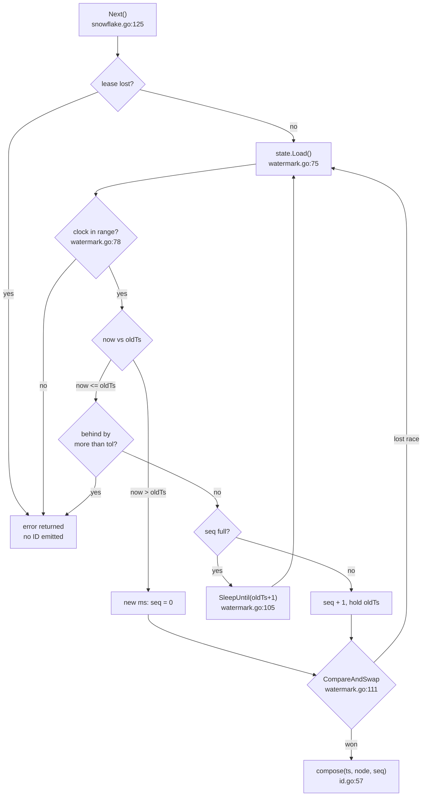
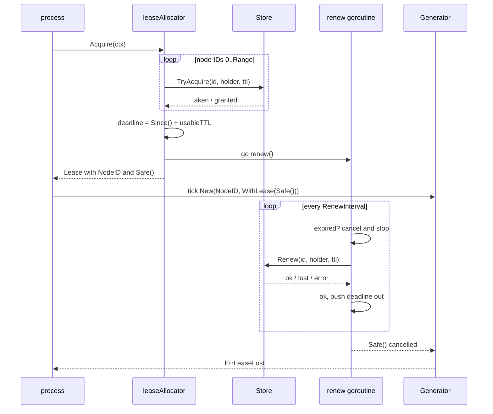

# Flows

[← 01-architecture.md](01-architecture.md) · [index](README.md) · next: [03-structure.md](03-structure.md)

## The headline flow: generating one ID

Entry point: [`Generator.Next`](../../snowflake.go#L125). Everything below
happens on the calling goroutine — there is no background work, no channel, no
mutex on this path.



Step by step:

1. **Lease check** — [snowflake.go:126](../../snowflake.go#L126). A plain
   `atomic.Bool`, not `context.Err()`, because the hot path cannot afford the
   mutex inside a context.
2. **Load the state** — [watermark.go:75](../../watermark.go#L75). This must
   happen *before* the clock is read; see the note below.
3. **Read the clock** — [watermark.go:78](../../watermark.go#L78), via
   `watermark.timestamp` at [watermark.go:51](../../watermark.go#L51), which
   subtracts `Epoch` and rejects anything the 41-bit field cannot hold.
4. **Pick the new position** — [watermark.go:84](../../watermark.go#L84). Three
   cases collapse into two branches, because `now == oldTs` is a regression of
   zero and shares the code path with a genuine backward step.
5. **Publish with one CAS** — [watermark.go:111](../../watermark.go#L111). On
   failure the loop restarts and re-reads *both* values in the same order.
6. **Compose the ID** — [id.go:57](../../id.go#L57). The node ID was
   pre-shifted at construction ([snowflake.go:102](../../snowflake.go#L102)),
   so this is one OR.

Owned by [03-structure.md](03-structure.md#root-package-tick).

### The two ordering rules

Both are load-bearing, both are one line, and both are commented at the point
they apply.

**Load the state before reading the clock**
([watermark.go:71](../../watermark.go#L71)). Read the clock first and a
concurrent advance can move the watermark past the reading you already took,
which is indistinguishable from the clock having moved backward. The result is
a spurious `ErrClockRegression` on a healthy host, under contention only.
[regression_test.go](../../regression_test.go) pins this with a zero-tolerance
contended run against a forward-only clock.

**Wait relative to the watermark, not the wall clock**
([watermark.go:105](../../watermark.go#L105)). While regressed the watermark is
already ahead of the clock, so `SleepUntil(now+1)` returns immediately and the
loop spins. The target is `Epoch + oldTs + 1`.

### Where the other two formats join

`UUIDv7Generator.next` ([uuidv7.go:62](../../uuidv7.go#L62)) and
`ULIDGenerator.next` ([ulid.go:156](../../ulid.go#L156)) call the same
`watermark.advance`, then lay the returned `(ts, seq)` pair into 128 bits
instead of 64. Both add `Epoch` back at
[uuidv7.go:69](../../uuidv7.go#L69) and [ulid.go:162](../../ulid.go#L162),
because the watermark counts from `Epoch` while both formats embed Unix
milliseconds.

The counter is what orders IDs inside a millisecond: it lands in v7's `rand_a`
field ([uuidv7.go:79](../../uuidv7.go#L79)) and in the top 12 bits of ULID's
entropy ([ulid.go:173](../../ulid.go#L173)). The remaining random bits are
drawn fresh on every call, which avoids any race over regenerating
per-millisecond entropy.

## Bootstrap: constructing a generator

[`tick.New`](../../snowflake.go#L88):

1. Reject a node ID above `MaxNodeID` — [snowflake.go:89](../../snowflake.go#L89).
2. Apply options over the defaults — [snowflake.go:69](../../snowflake.go#L69).
   Defaults are a `SystemClock` and a 10ms regression tolerance.
3. Build the watermark with `SequenceBits` of counter —
   [snowflake.go:97](../../snowflake.go#L97).
4. **Read the clock once and fail if it is unusable** —
   [snowflake.go:98](../../snowflake.go#L98). This is why a container with an
   unset RTC dies at startup rather than at its first request.
5. Pre-shift the node ID — [snowflake.go:102](../../snowflake.go#L102).
6. If a lease context was supplied, reject it if already dead and otherwise
   start one goroutine watching it — [snowflake.go:104](../../snowflake.go#L104).

## Flow: claiming and holding a node ID

Entry point: [`leaseAllocator.Acquire`](../../worker/lease.go#L157). This is
the only flow in the codebase with a background goroutine.



1. **Scan for a free ID** — [worker/lease.go:158](../../worker/lease.go#L158),
   lowest first, stopping at `Range`. Exhausting the range returns
   `ErrNoFreeNodeID`.
2. **Set the safety deadline** —
   [worker/lease.go:173](../../worker/lease.go#L173). It is
   `Clock.Since() + usableTTL()`, a *monotonic* reading, so stepping the wall
   clock cannot extend or shorten a lease.
3. **Start the renew loop** — [worker/lease.go:227](../../worker/lease.go#L227).
4. **Check the deadline before renewing** —
   [worker/lease.go:245](../../worker/lease.go#L245). A goroutine that was
   descheduled past the deadline is already unsafe however the renewal turns
   out; this is the frozen-container case.
5. **Handle the three outcomes** —
   [worker/lease.go:254](../../worker/lease.go#L254). A transport error keeps
   retrying until the deadline runs out; `ok == false` means someone else owns
   the ID and stops immediately; success pushes the deadline out.

### The safety deadline

[worker/lease.go:140](../../worker/lease.go#L140):

```go
return c.TTL - c.MaxClockSkew - c.MaxRoundTrip - c.SafetyMargin
```

A holder must stop generating **before** its claim expires, not when it notices
the expiry. Three things sit between the two: the store's clock running ahead,
a renewal still in flight, and this process being descheduled. Subtracting all
three leaves the window during which the ID is provably held. Defaults are at
[worker/lease.go:83](../../worker/lease.go#L83), and a TTL leaving no usable
window is rejected at construction
([worker/lease.go:118](../../worker/lease.go#L118)).

Owned by [03-structure.md](03-structure.md#worker--node-id-allocation).

## Flow: one simulator run

Entry point: [`sim.Run`](../../sim/sim.go#L183). No real time, no goroutines,
no network — every decision comes from a seeded PRNG
([sim/sim.go:188](../../sim/sim.go#L188)) so a failing run replays exactly.

Per step ([sim/sim.go:209](../../sim/sim.go#L209)):

1. **Refill empty node IDs** whose handover cooldown has passed —
   [sim/sim.go:213](../../sim/sim.go#L213). The cooldown
   ([sim/sim.go:201](../../sim/sim.go#L201)) is the simulated equivalent of
   `worker`'s safety window.
2. **Shuffle the process order** — [sim/sim.go:227](../../sim/sim.go#L227), so
   none is systematically first.
3. **Advance each clock** — [sim/sim.go:236](../../sim/sim.go#L236).
   `Advance` moves wall *and* monotonic, which is time passing; `stepClock`
   moves wall only, which is clock error.
4. **Maybe inject a fault** — [sim/sim.go:240](../../sim/sim.go#L240),
   dispatching into [sim/faults.go:11](../../sim/faults.go#L11). Six kinds:
   small and large backward steps, a forward correction, a drift change, a
   pause, and a crash.
5. **Generate with `TryNext`** — [sim/sim.go:255](../../sim/sim.go#L255).
   Nothing blocks, so an exhausted sequence is just a quieter step. Errors are
   counted, not failed on: refusing is the library working.
6. **Log the emission against true time** —
   [sim/sim.go:265](../../sim/sim.go#L265).

Afterwards `sim.Check` ([sim/invariants.go:23](../../sim/invariants.go#L23))
reads the log — not the generators — and verifies four invariants:

| Invariant | Checker | Line |
|---|---|---|
| I1 uniqueness | `checkUniqueness` | [sim/invariants.go:33](../../sim/invariants.go#L33) |
| I2 per-process monotonicity | `checkPerProcessMonotonicity` | [sim/invariants.go:68](../../sim/invariants.go#L68) |
| I3 node-ID exclusivity | `checkNodeIDExclusivity` | [sim/invariants.go:89](../../sim/invariants.go#L89) |
| I4 k-sortability | `checkSortability` | [sim/invariants.go:119](../../sim/invariants.go#L119) |

I4's bound is derived rather than guessed
([sim/sim.go:120](../../sim/sim.go#L120)): every clock stays within `MaxOffset`
of true time, and an emitted timestamp never exceeds the highest reading its
clock produced, so emissions more than twice `MaxOffset` apart are ordered.

## Flow: the locality measurement

[`TestInsertLocality`](../../bench/locality_test.go) builds one generator per
format, inserts 200,000 keys into a fresh
[`btree.Tree`](../../internal/btree/btree.go#L65) each, and compares.

The measured quantity is **page writes**: a dirty page evicted from a
fixed-size LRU pool, plus whatever is still dirty at the end
([internal/btree/btree.go:184](../../internal/btree/btree.go#L184)). Every node
access routes through `Tree.touch`
([internal/btree/btree.go:77](../../internal/btree/btree.go#L77)) into
`pool.touch` ([internal/btree/pool.go:32](../../internal/btree/pool.go#L32)),
which is where a hit, a miss, or a dirty eviction is recorded.

Result, from [docs/LOCALITY.md](../LOCALITY.md): the three time-ordered formats
each cost 6,444 page writes; UUIDv4 costs 165,637. Owned by
[03-structure.md](03-structure.md#internalbtree--the-measurement-model).

## Flow: the demo cluster

[`cmd/tickd/main.go`](../../cmd/tickd/main.go#L20) dispatches on `os.Args[1]`
into one of three modes.

A generator ([cmd/tickd/generator.go:31](../../cmd/tickd/generator.go#L31))
builds an httpstore client, acquires a lease with retry
([cmd/tickd/generator.go:84](../../cmd/tickd/generator.go#L84)), wires the
lease into a generator
([cmd/tickd/generator.go:68](../../cmd/tickd/generator.go#L68)), and mints on a
ticker ([cmd/tickd/generator.go:97](../../cmd/tickd/generator.go#L97)). On
`ErrLeaseLost` it stops and records it
([cmd/tickd/generator.go:108](../../cmd/tickd/generator.go#L108)).

The verifier ([cmd/tickd/verify.go:18](../../cmd/tickd/verify.go#L18)) drains
every generator once a second and reports any ID seen twice. Unreachable
generators are counted separately, because the scenario disconnects them on
purpose and that is not a uniqueness failure
([cmd/tickd/verify.go:49](../../cmd/tickd/verify.go#L49)).
